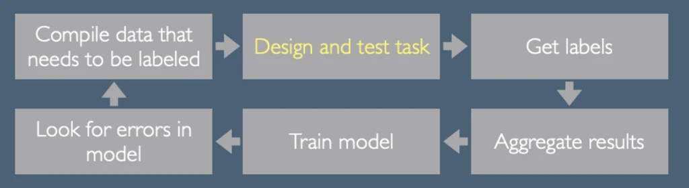
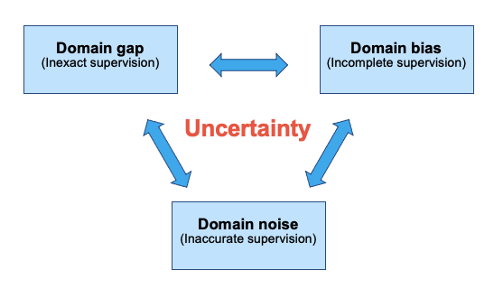
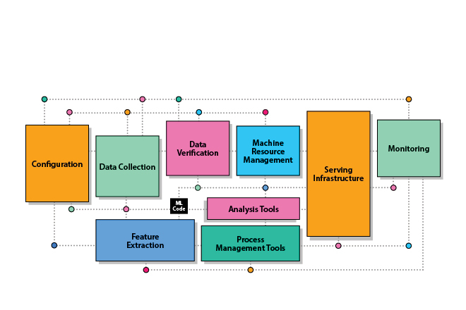

# ZK Lab 01: Preparation

## [Data Centric AI](https://datacentricai.org/)

### Definition
Data-centric AI is the discipline of systematically engineering the data used to build an AI system.

### Data-centric AI Resource Hub
A place to share cutting edge techniques and best practices for using data centric AI methods to build successful machine learning systems.

### Topics
#### [Labeling and Crowdsourcing](https://datacentricai.org/labeling-and-crowdsourcing/)

- Suggestions:
    - Label many of the examples yourself before designing the task.
    - Pay and treat your workers fairly.
    - Always start with small pilots.
    - Always assume that the annotators are trying hard to build a model of your intentions: when something goes wrong, your reaction should be “what did I do wrong in communicating my intent?”, not “why weren’t they paying attention?”
    - Train with feedback.
    - It can often make sense to hire fewer people, more full time.

#### [Data Augmentation](https://datacentricai.org/data-augmentation/)

- Data limitations:
    - **Domain gaps**: The data you train your model with is quite different from the data you have to predict on in the real world.
    - **Data bias**: When the data you collect has imbalances due to societal bias, how can you design methods that can overcome them? 
    - **Data noise**: Noise can come from a variety of sources, including where labels are ambiguous, cluttered, or otherwise corrupted. 

- Definition of Data Augmentation:
    - Self-Supervision: When you have limited labeled data, you can try combining it with unlabeled data. 
        - rotation
        - cropping
    - Synthetic Data: While synthetic data is still in its infancy, there has been ongoing advances in generative models and it will become hugely important in the future for testing systems such as autonomous driving or robot learning. 

- Data-centric principles in data augmentation:
    - Core: the balance of positive and negative examples.
    - Also: combine self-supervision with weak supervision.

#### [Data in Deployment](https://datacentricai.org/data-in-deployment/)

- Technical debt in machine learning:
    - The concept of technical debt originally comes from the world of software engineering, where it has often been found that pushing to develop software very quickly can create long term maintenance costs that must be paid back later, and that if left unaddressed can compound over time.  
    - ML code – the bit that we tend to think of as the cool part – is actually a small component of the overall system.
    - In a lot of settings it is not actually statistically useful to get more data.

- Three places to start:
    - Audit and monitor data quality. 
    - Create data sheets for data sets. 
    - Create and apply stress tests using data.

## [Hugging Face](https://huggingface.co/)

### Goal
Hugging Face Hub is building the largest collection of models, datasets and metrics in order to democratize and advance AI for everyone.

### Repository
The Hugging Face Hub hosts Git-based repositories which are storage spaces that can contain all your files.

The Hub currently hosts three different repo types:
- models
- datasets
- Spaces, which are ML demo apps

These repositories have multiple advantages over other hosting solutions:
- versioning
- commit history and diffs
- branches

On top of that, Hugging Face Hub repositories have many other advantages, for instance for models:
- Model repos provide useful metadata about their tasks, languages, metrics, etc.
- Anyone can play with the model directly in the browser!
- Training metrics charts are displayed if the repository contains TensorBoard traces.
- An API is provided to use the models in production settings.
- [Over 10 frameworks](https://huggingface.co/docs/hub/libraries) such as Transformers, Asteroid and ESPnet support using models from the Hugging Face Hub.

### widget
Many model repos have a widget that allows anyone to do inference directly in the browser.

Some examples:

- [Named Entity Recognition](https://huggingface.co/spacy/en_core_web_sm?text=My+name+is+Sarah+and+I+live+in+London) using spaCy[https://spacy.io/].
- [Image Classification](https://huggingface.co/google/vit-base-patch16-224) using [Transformers](https://github.com/huggingface/transformers).
- [Text to Speech](https://huggingface.co/julien-c/ljspeech_tts_train_tacotron2_raw_phn_tacotron_g2p_en_no_space_train) using [ESPnet](https://github.com/espnet/espnet).
- [Sentence Similarity](https://huggingface.co/osanseviero/full-sentence-distillroberta3) using [Sentence Transformers](https://github.com/UKPLab/sentence-transformers).

You can try out all the widgets [here](https://huggingface-widgets.netlify.app/).

### Inference API
The Inference API allows you to send HTTP requests to models in the Hugging Face Hub. The Inference API is 2x to 10x faster than the widgets.

### Explore Hugging Face Hub
YouTube [[Link]](https://youtu.be/XvSGPZFEjDY).

### Model's Type of Inference API and Widget
- `pipeline_tag`: determine which pipeline and widget to display
- `config.json`: transformers

### Load/Push from/to the Hub
YouTube [[Link]](https://youtu.be/rkCly_cbMBk)

