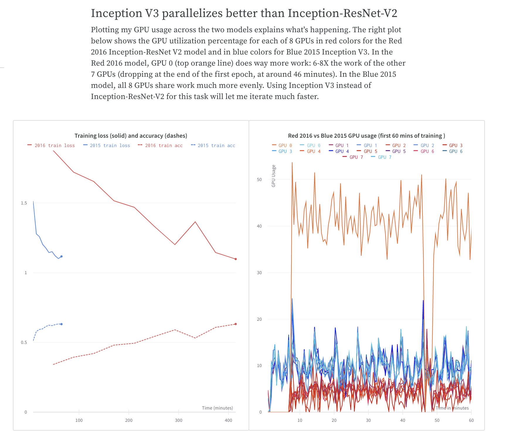
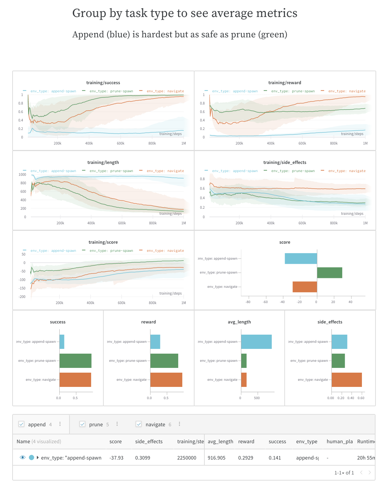
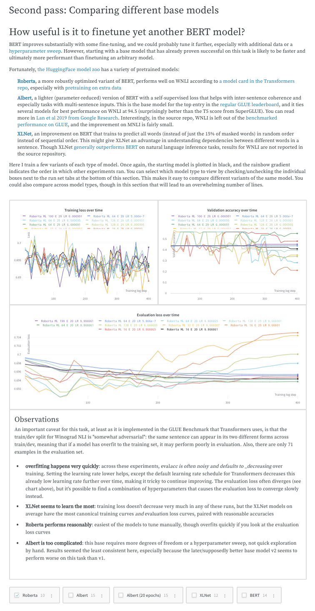

# [ZK Lab] #3: Platform - Weights & Biases

Weights & Biases is the machine learning platform for developers to build better models faster. 

Use W&B's lightweight, interoperable tools to 
- track experiments and version quickly
- iterate on datasets
- evaluate model performance
- reproduce models
- visualize results
- spot regressions
- share findings with colleagues

## Experiment Tracking

- Use the `wandb` Python library to track machine learning experiments with a few lines of code. 

- Have lightweight [integrations](https://docs.wandb.ai/guides/integrations) for PyTorch and Keras.

## Integrations
Weights & Biases integrations make it fast and easy to set up experiment tracking and data versioning inside existing projects. 

Useful Links:
- [Examples](https://github.com/wandb/examples): GitHub repo with working, end-to-end code examples for all of our integrations
- [Colab](https://github.com/wandb/examples/tree/master/colabs): Try out W&B inside different frameworks, such as PyTorch Lightning, in an interactive notebook -- no installation required
- [Video Tutorials](https://www.youtube.com/playlist?list=PLD80i8An1OEGajeVo15ohAQYF1Ttle0lk): Learn to use W&B with YouTube videos for PyTorch, Keras, and more.

## Collaborative Reports

    <iframe width="735" height="414" src="https://www.youtube.com/embed/2xeJIv_K_eI" title="YouTube video player" frameborder="0" allow="accelerometer; autoplay; clipboard-write; encrypted-media; gyroscope; picture-in-picture" allowfullscreen></iframe>

Reports let you organize and embed visualizations, describe your findings, share updates with collaborators, and more.

### Typical use cases for reports

#### Notes: Add a visualization with a quick summary

Capture an important observation, an idea for future work, or a milestone reached in the development of a project. All experiment runs in your report will link to their parameters, metrics, logs, and code, so you can save the full context of your work.

#### Collaboration: Share findings with your colleagues

Explain how to get started with a project, share what you've observed so far, and synthesize the latest findings. Your colleagues can make suggestions or discuss details using comments on any panel or at the end of the report.

#### Work log: Track what you've tried and plan next steps

Write down your thoughts on experiments, your findings, and any gotchas and next steps as you work through a project, keeping everything organized in one place. This lets you "document" all the important pieces beyond your scripts.

## Data + Model Versioning

Use W&B Artifacts for dataset versioning, model versioning, and tracking dependencies and results across machine learning pipelines. Think of an artifact as a versioned folder of data. You can store entire datasets directly in artifacts, or use artifact references to point to data in other systems like S3, GCP, or your own system.

## Data Visualization

Use W&B Tables to log, query, and analyze tabular data. Understand your datasets, visualize model predictions, and share insights in a central dashboard.
- Compare changes precisely across models, epochs, or individual examples
- Understand higher-level patterns in your data
- Capture and communicate your insights with visual samples

## Hyperparameter Tuning

<iframe width="735" height="414" src="https://www.youtube.com/embed/9zrmUIlScdY" title="YouTube video player" frameborder="0" allow="accelerometer; autoplay; clipboard-write; encrypted-media; gyroscope; picture-in-picture" allowfullscreen></iframe>

Use Weights & Biases Sweeps to automate hyperparameter optimization and explore the space of possible models.

## Model Management
A Model Registry is a system of record for organizing ML Models - often serving as an interface between model producers and consumers. This guide will show you how to use W&B as a Model Registry to track and report on the complete workflow of developing a model:

- Model Catalog & Versioning: Save and restore every version of your model & learned parameters - organize versions by use case and objective.
- Model Metadata: Track training metrics, assign custom metadata, and document rich markdown descriptions of your models.
- Model Lineage Tracking & Reproducibility: Track the exact code, hyperparameters, & training dataset used to produce the model.
- Model Lifecycle: Promote promising models to positions like "staging" or "production" - allowing downstream users to fetch the best model automatically.
Model Reporting: Create a Report dashboard to summarize model progression and performance over time