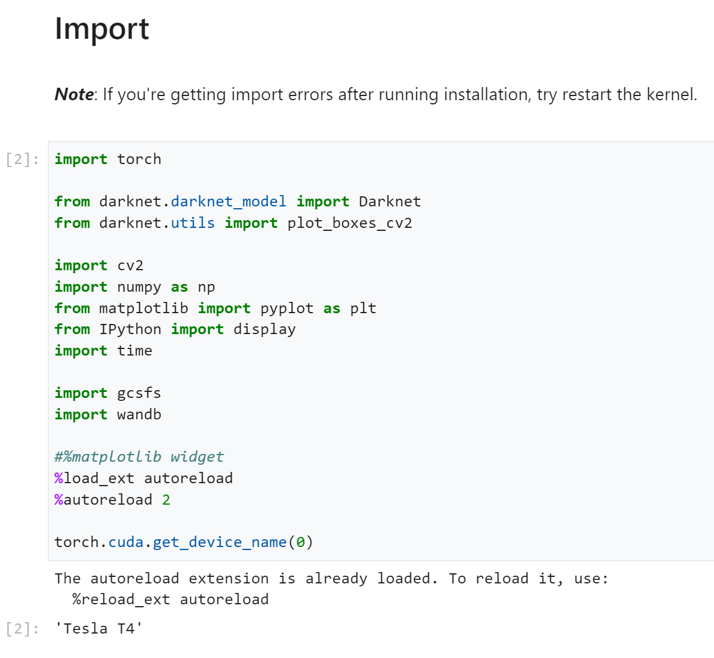
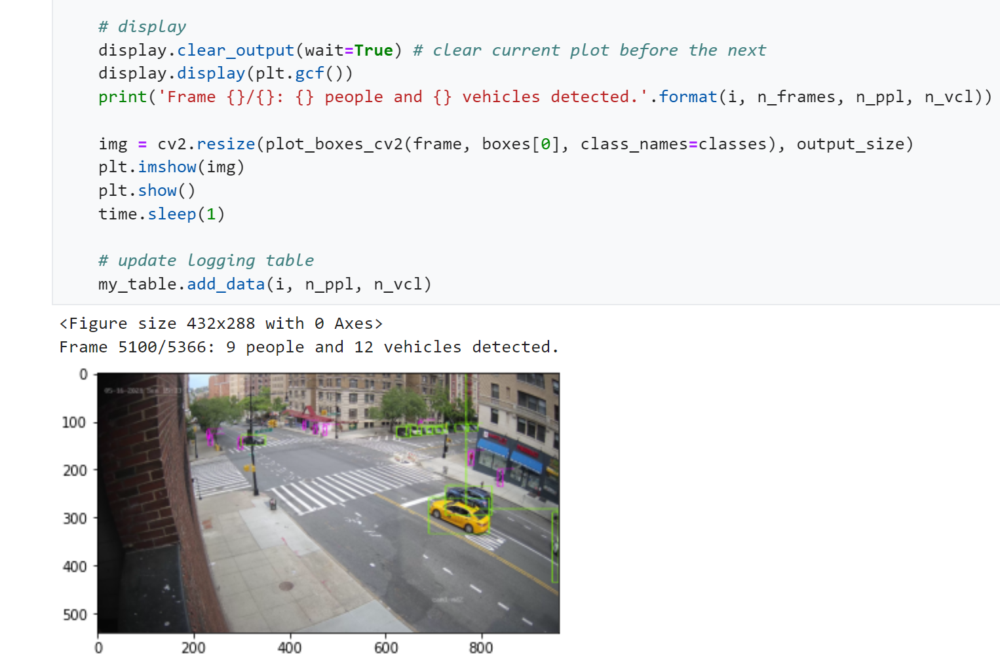
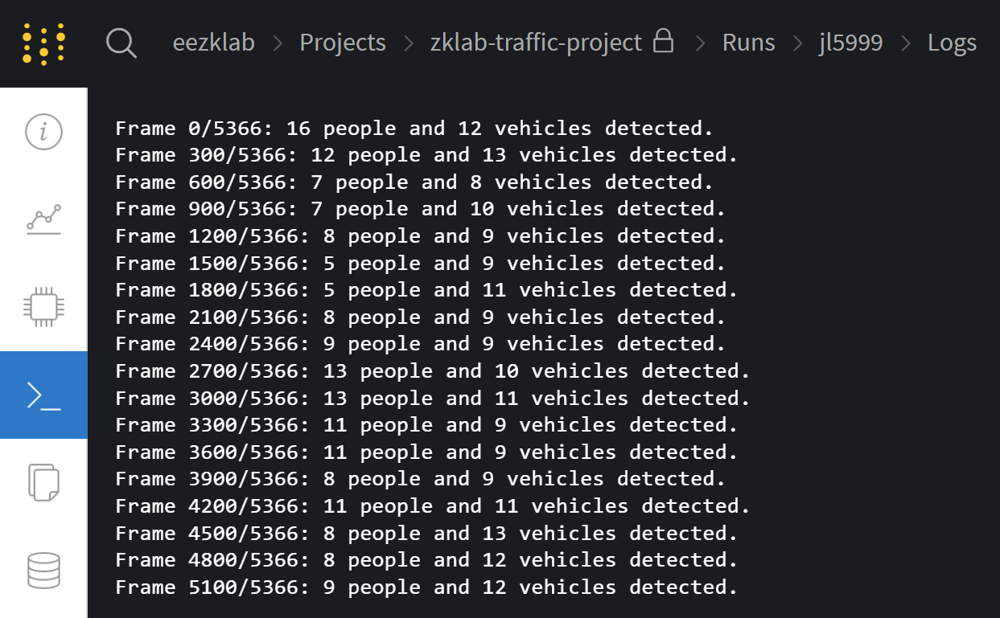
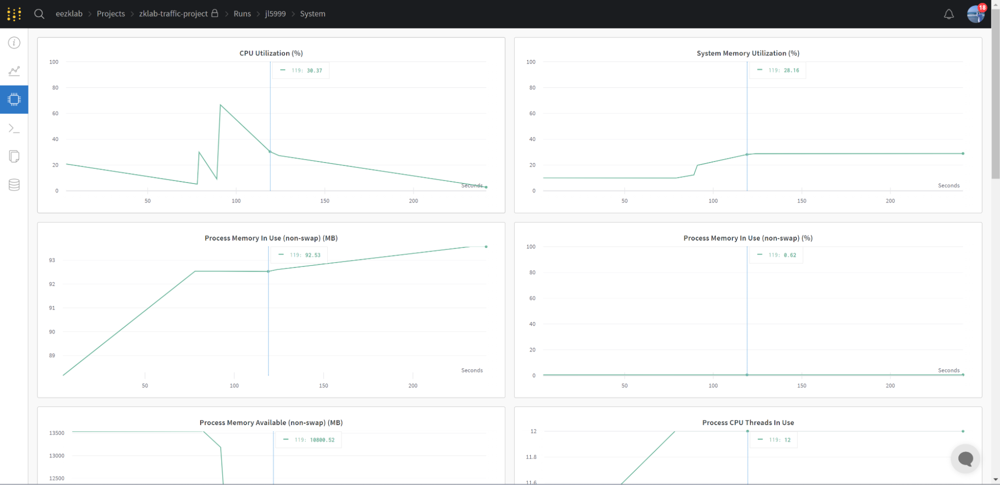

# [ZK Lab] #7: Tool: Demo of YOLO V4 + W&B

- Follow the Instrctions in [this file](https://docs.google.com/document/d/1EFezfWFGqiPyRJZg4xyv0d0knfPTdvLabWUzX6JuR34/edit#heading=h.9uriig7xeant) to set up YOLO V4 environment and workflow on GCP.
    - Personal Vertex AI instance [[Link]](https://console.cloud.google.com/vertex-ai/workbench/details/locations/us-central1/runtimes/yolov4-pytorch-jl5999?project=ecbm4040-ta).
- Clone the [GitHub repository](https://github.com/zk2172-columbia/ProjectTrafficIntersection.COSMOS.V2.git) related to this project.
- Run demo.ipynb.
    - Screenshots:
    - 
    - 

- Update W&B Workspace Log:
    - Screenshots:
    - 
    - 

